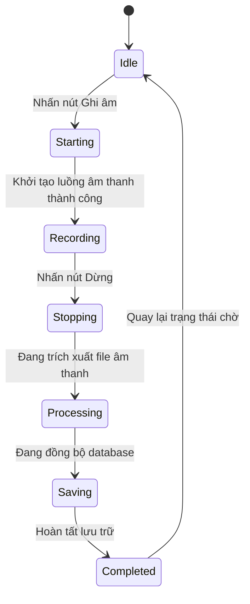
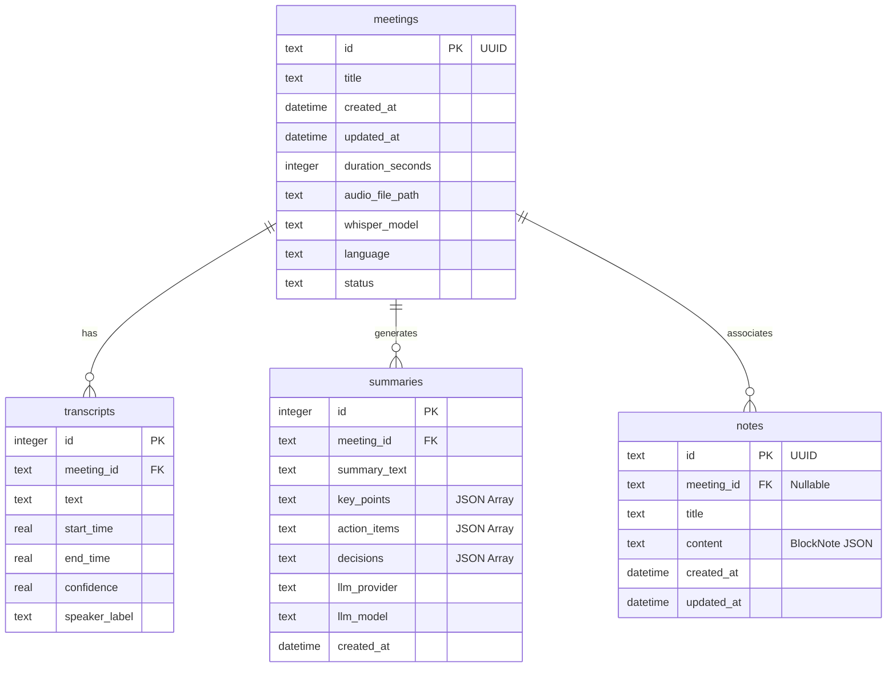

# ĐẠI HỌC QUỐC GIA HÀ NỘI
## TRƯỜNG ĐẠI HỌC CÔNG NGHỆ

<br>
<br>

# MEETILY
## Ứng dụng ghi âm và tóm tắt cuộc họp bằng AI

<br>
<br>
<br>

**Dự án Công Nghệ**  
**Giảng viên hướng dẫn:** PGS.TS LÊ SỸ VINH  
**Học viên/Sinh viên thực hiện:**  
*   Trần Anh Tuấn (23021710) - 90%
*   Nguyễn Văn Tiền (23021964) - 0%
*   Nguyễn Thị Huyền Thương (22028323) - 10%

**HÀ NỘI – 2026**

---

## TÓM TẮT ĐỀ TÀI

Trong bối cảnh các cuộc họp trực tuyến và trực tiếp ngày càng gia tăng về tần suất lẫn độ phức tạp, việc ghi chép và tổng hợp thông tin một cách hiệu quả trở thành nhu cầu cấp thiết đối với cá nhân và tổ chức. Các giải pháp hiện có trên thị trường như Otter.ai, Fireflies hay Microsoft Copilot đều yêu cầu truyền tải dữ liệu âm thanh lên máy chủ đám mây, làm nảy sinh lo ngại nghiêm trọng về bảo mật thông tin và quyền riêng tư.

Đề tài này trình bày quá trình nghiên cứu, thiết kế và triển khai ứng dụng Meetily — một ứng dụng desktop đa nền tảng cho phép ghi âm, phiên âm và tóm tắt cuộc họp hoàn toàn trên máy cục bộ (offline-first), không phụ thuộc vào bất kỳ dịch vụ đám mây nào. Toàn bộ quá trình xử lý âm thanh, nhận dạng giọng nói và sinh tóm tắt đều diễn ra ngay trên thiết bị của người dùng, đảm bảo tính bảo mật tuyệt đối cho thông tin nhạy cảm.

Meetily được xây dựng trên kiến trúc ba tầng gồm: lớp giao diện người dùng sử dụng Tauri (Rust) kết hợp Next.js/React; lớp xử lý nghiệp vụ dùng FastAPI (Python); và lớp nhận dạng giọng nói dựa trên Whisper.cpp (C++). Ứng dụng tích hợp pipeline âm thanh chuyên nghiệp với Voice Activity Detection (VAD), RMS ducking, resampling và noise suppression. Đồng thời hỗ trợ đa dạng các mô hình ngôn ngữ lớn (LLM) thông qua Ollama chạy cục bộ hoặc các API đám mây tùy chọn như Claude, GPT-4, Groq và OpenRouter để tạo tóm tắt thông minh dưới dạng cấu trúc JSON chặt chẽ.

Kết quả đạt được bao gồm: ứng dụng desktop chạy ổn định trên macOS, Windows và Linux; khả năng phiên âm thời gian thực với độ trễ thấp; hệ thống lập lịch tài nguyên `AudioScheduler` tối ưu hóa luồng ghi âm live và xử lý batch; hệ thống tóm tắt linh hoạt; và giao diện người dùng hiện đại, trực quan. Đề tài đóng góp một giải pháp thực tiễn cho bài toán quản lý thông tin cuộc họp với ưu tiên hàng đầu về bảo mật và quyền riêng tư.

**Từ khóa:** ghi âm cuộc họp, phiên âm tự động, Whisper, Tauri, FastAPI, LLM, privacy-first, offline AI, AudioScheduler.

---

## THÀNH VIÊN DỰ ÁN

| Họ và Tên | Mã Sinh viên | Công Việc | Tỷ Lệ Đóng góp |
| :--- | :--- | :--- | :--- |
| **Trần Anh Tuấn** | 23021710 | Trực tiếp thiết kế hệ thống, lập trình pipeline âm thanh (Rust), phát triển giao diện Next.js, tích hợp Whisper.cpp, triển khai API tóm tắt đa LLM và lập lịch AudioScheduler. | 90% |
| **Nguyễn Văn Tiền** | 23021964 | Không tham gia thực hiện dự án. | 0% |
| **Nguyễn Thị Huyền Thương** | 22028323 | Tham gia nghiên cứu tài liệu về VAD, viết báo cáo và kiểm thử giao diện người dùng. | 10% |

---

## CHƯƠNG 1: GIỚI THIỆU

### 1.1. Bối cảnh và Động lực Nghiên cứu
Sự dịch chuyển mạnh mẽ sang các mô hình làm việc từ xa (remote work) và làm việc kết hợp (hybrid work) sau đại dịch đã làm tăng vọt số lượng và thời lượng các cuộc hội họp trực tuyến. Việc ghi nhận và lưu trữ biên bản cuộc họp (meeting minutes) là yêu cầu cốt lõi của các tổ chức nhằm theo dõi quyết định và giao việc. Tuy nhiên, ghi chép thủ công tiêu tốn rất nhiều thời gian và dễ bỏ sót thông tin quan trọng.

Sự bứt phá của AI, cụ thể là các mô hình nhận dạng giọng nói tự động (ASR) như OpenAI Whisper và các mô hình ngôn ngữ lớn (LLM), đã giúp tự động hóa hoàn toàn quy trình này. Mặc dù vậy, các công cụ phổ biến hiện nay đều dựa hoàn toàn vào điện toán đám mây. Việc tải lên hàng ngàn giờ âm thanh chứa thông tin nội bộ nhạy cảm cấu thành nguy cơ lớn về an ninh thông tin. Động lực của nghiên cứu này là tạo ra một môi trường xử lý khép kín trên thiết bị của người dùng (Offline AI/Edge AI), vừa khai thác tối đa sức mạnh của mô hình AI hiện đại, vừa bảo vệ dữ liệu cá nhân và doanh nghiệp một cách tuyệt đối.

### 1.2. Vấn đề Thực tiễn
Nhóm nghiên cứu đã tổng hợp các bất cập của thị trường hiện nay trong bảng so sánh sau:

| Vấn đề | Giải pháp hiện tại | Hạn chế |
| :--- | :--- | :--- |
| **Ghi chép thủ công** | Ghi tay, soạn thảo thủ công | Mất thời gian, độ chính xác thấp, dễ bỏ sót. |
| **Bảo mật thông tin** | Otter.ai, Fireflies.ai, Zoom AI | Dữ liệu âm thanh chuyển lên cloud, không phù hợp cho dữ liệu quân sự, tài chính, y tế. |
| **Chi phí vận hành** | Google Speech-to-Text API | Phí tính theo phút ghi âm, tích lũy chi phí rất lớn cho doanh nghiệp. |
| **Sự phụ thuộc hạ tầng** | MS Copilot, ChatGPT | Bắt buộc có kết nối Internet tốc độ cao; không hoạt động khi mất mạng hoặc trong khu vực bảo mật. |

### 1.3. Mục tiêu Đề tài
*   **Mục tiêu 1:** Xây dựng ứng dụng desktop đa nền tảng (macOS, Windows, Linux) hỗ trợ thu âm đa luồng (microphone của người nói và system audio từ loa).
*   **Mục tiêu 2:** Tích hợp pipeline phiên âm thời gian thực (real-time transcription) sử dụng Whisper.cpp chạy cục bộ, đạt tốc độ phản hồi dưới 3 giây.
*   **Mục tiêu 3:** Thiết kế module xử lý ngôn ngữ tóm tắt tự động, tích hợp đa dạng nhà cung cấp (Ollama cho offline và các API đám mây cho online) với định dạng JSON cấu trúc.
*   **Mục tiêu 4:** Xây dựng hệ thống lập lịch tài nguyên `AudioScheduler` thông minh để ngăn chặn việc xử lý file nền làm ảnh hưởng đến tiến trình ghi âm thời gian thực.
*   **Mục tiêu 5:** Thiết kế giao diện Next.js hiện đại, trực quan, hỗ trợ quản lý cuộc họp, soạn thảo ghi chú rich-text và tìm kiếm cục bộ.

### 1.4. Phạm vi và Giới hạn
*   **Phạm vi:** Nghiên cứu và hoàn thiện các chức năng dựa trên nền tảng mã nguồn mở Meetily của Zackriya Solutions (Giấy phép MIT). Nhóm thực hiện đã phát triển thêm các tính năng điều phối luồng, cải tiến bộ lập lịch CPU/GPU (`AudioScheduler`), tinh chỉnh VAD test generator, tối ưu hóa giao tiếp IPC, sửa đổi lỗi hiển thị và viết tài liệu hướng dẫn kỹ thuật chi tiết.
*   **Giới hạn:** Ứng dụng không tự huấn luyện lại mô hình Whisper hay LLM từ đầu mà tập trung vào các kỹ thuật lượng tử hóa (quantization), tối ưu hóa luồng suy luận (inference pipeline) và xử lý tín hiệu số (DSP) trên phần cứng thiết bị đầu cuối.

### 1.5. Cấu trúc Báo cáo
Báo cáo được tổ chức thành 9 chương:
*   **Chương 1:** Giới thiệu bối cảnh, mục tiêu và phạm vi đề tài.
*   **Chương 2:** Phân tích các yêu cầu chức năng, phi chức năng và sơ đồ Use Case.
*   **Chương 3:** Trình bày cơ sở lý thuyết về Whisper, VAD, LLM và xử lý âm thanh.
*   **Chương 4:** Thiết kế kiến trúc tổng thể, luồng dữ liệu và module `AudioScheduler`.
*   **Chương 5:** Thiết kế cơ sở dữ liệu quan hệ SQLite và cơ chế lưu trữ tạm IndexedDB.
*   **Chương 6:** Thiết kế giao diện UI/UX và luồng onboarding cho người dùng mới.
*   **Chương 7:** Quy trình triển khai phát triển, build cross-platform và CI/CD.
*   **Chương 8:** Mô tả các tính năng cốt lõi và các kịch bản vận hành thực tế.
*   **Chương 9:** Kết quả đạt được, hạn chế hiện tại và định hướng phát triển tương lai.

---

## CHƯƠNG 2: PHÂN TÍCH YÊU CẦU

### 2.1. Đối tượng Người dùng
Ứng dụng Meetily hướng đến các nhóm đối tượng chính sau:
1.  **Nhân viên văn phòng và Quản lý dự án:** Tham gia họp liên tục, cần tóm tắt nhanh biên bản và các đầu việc cần làm (action items).
2.  **Nhà báo, Nghiên cứu sinh:** Thực hiện phỏng vấn sâu, thu thập tài liệu khoa học cần độ chính xác cao và tuyệt đối không được rò rỉ dữ liệu nguồn.
3.  **Doanh nghiệp Nhà nước và Tổ chức Tài chính:** Các đơn vị có chính sách bảo mật dữ liệu nghiêm ngặt, cấm truyền âm thanh ra mạng Internet bên ngoài.

### 2.2. Yêu cầu Chức năng
Hệ thống được thiết kế với 18 yêu cầu chức năng chính chia làm 4 nhóm:

#### 2.2.1. Nhóm chức năng Ghi âm
*   **FR-01:** Ghi âm đồng thời hai luồng đầu vào: Thiết bị Microphone vật lý và Âm thanh hệ thống (System Audio - loopback phát từ các ứng dụng Zoom, Teams, Web...).
*   **FR-02:** Cho phép lựa chọn và cấu hình thiết bị đầu vào động từ giao diện cài đặt.
*   **FR-03:** Hiển thị trực quan cường độ tín hiệu (Audio Waveform) thời gian thực trong khi ghi âm.
*   **FR-04:** Hỗ trợ thu nhỏ ứng dụng xuống khay hệ thống (System Tray) và tiếp tục ghi âm nền.
*   **FR-05:** Tự động phát hiện ứng dụng họp đang hoạt động (Auto Meeting Detection) để đưa ra thông báo gợi ý ghi âm.

#### 2.2.2. Nhóm chức năng Phiên âm
*   **FR-06:** Hiển thị kết quả phiên âm dạng văn bản (text segments) theo thời gian thực với độ trễ dưới 3 giây.
*   **FR-07:** Cho phép lựa chọn ngôn ngữ nguồn, chế độ tự động nhận diện ngôn ngữ (auto-detect) và cấu hình preferences ngôn ngữ toàn cục (`set_language_preference`).
*   **FR-08:** Hỗ trợ tải xuống và chuyển đổi linh hoạt các kích thước mô hình Whisper (tiny, base, small, medium, large).
*   **FR-09:** Nhập (import) các file âm thanh sẵn có (WAV, MP3, M4A, FLAC) để phiên âm ngoại tuyến.
*   **FR-10:** Tự động phục hồi tiến trình phiên âm (Transcript Recovery) nếu ứng dụng đột ngột mất nguồn hoặc crash.

#### 2.2.3. Nhóm chức năng Tóm tắt AI
*   **FR-11:** Sinh tóm tắt tự động dựa trên nội dung phiên âm bằng LLM.
*   **FR-12:** Tích hợp đa dạng nhà cung cấp dịch vụ LLM: Ollama (hoàn toàn ngoại tuyến), OpenAI, Claude, Groq và OpenRouter.
*   **FR-13:** Kết quả tóm tắt phải được trả về theo cấu trúc phân định rõ ràng (Tiêu đề, Điểm chính, Quyết định, Hành động cần làm).
*   **FR-14:** Cho phép người dùng chỉnh sửa và lưu trữ nhiều phiên bản tóm tắt khác nhau.

#### 2.2.4. Nhóm chức năng Quản lý
*   **FR-15:** Hiển thị danh sách lịch sử các cuộc họp kèm theo thời gian, thời lượng và trạng thái.
*   **FR-16:** Cho phép tìm kiếm toàn văn cuộc họp dựa trên tiêu đề hoặc nội dung phiên âm.
*   **FR-17:** Xuất dữ liệu phiên âm và tóm tắt ra các định dạng phổ biến (Markdown, Text).
*   **FR-18:** Tích hợp trình ghi chú BlockNote (dạng Notion-style) liên kết trực tiếp với mã cuộc họp.

### 2.3. Yêu cầu Phi chức năng

| Mã | Yêu cầu phi chức năng | Mức độ ưu tiên | Mô tả chi tiết |
| :--- | :--- | :--- | :--- |
| **NFR-01** | Hiệu năng xử lý | Cao | Thời gian xử lý VAD và sinh kết quả text trung gian không được trễ quá 3 giây trên CPU thông dụng. |
| **NFR-02** | Tính riêng tư và Bảo mật | Rất cao | Không truyền âm thanh hoặc telemetry mặc định lên máy chủ đám mây. |
| **NFR-03** | Tính đa nền tảng | Cao | Chạy đồng bộ trên macOS 13+, Windows 10+ và Linux (Ubuntu 22.04+). |
| **NFR-04** | Tính độc lập ngoại tuyến | Cao | Phải hoạt động bình thường mà không cần kết nối mạng khi dùng Ollama và Whisper cục bộ. |
| **NFR-05** | Quản lý tài nguyên | Trung bình | Sử dụng RAM dưới 2GB ở trạng thái nhàn rỗi (không tính khi tải mô hình Whisper Large). |
| **NFR-06** | Tính chịu lỗi | Cao | Đảm bảo tính toàn vẹn dữ liệu SQLite khi luồng ghi âm bị ngắt đột ngột. |
| **NFR-07** | Thiết kế mở rộng | Trung bình | Cấu trúc code dạng module hóa, dễ dàng tích hợp thêm các API LLM mới thông qua các lớp adapter. |
| **NFR-08** | Khả năng sử dụng | Cao | Giao diện thân thiện, dễ cài đặt và tối giản các bước tương tác. |

### 2.4. Sơ đồ Ca Sử dụng (Use Case)

```mermaid
usecaseDiagram
    actor User as "Người dùng"
    
    usecase UC01 as "Bắt đầu ghi âm"
    usecase UC02 as "Xem transcript thời gian thực"
    usecase UC03 as "Dừng & lưu cuộc họp"
    usecase UC04 as "Tạo tóm tắt AI"
    usecase UC05 as "Import file âm thanh"
    usecase UC06 as "Cấu hình mô hình"
    usecase UC07 as "Xem lịch sử cuộc họp"
    usecase UC08 as "Soạn thảo ghi chú"

    User --> UC01
    User --> UC02
    User --> UC03
    User --> UC04
    User --> UC05
    User --> UC06
    User --> UC07
    User --> UC08
```

#### Mô tả Chi tiết các Ca Sử dụng Chính:

*   **UC-01: Bắt đầu ghi âm**
    *   *Actor:* Người dùng.
    *   *Mô tả:* Người dùng chọn thiết bị đầu vào (Mic/Speaker) trên màn hình chính và nhấn nút "Record". Hệ thống khởi tạo luồng âm thanh và bắt đầu phân tích tín hiệu.
*   **UC-02: Xem transcript thời gian thực**
    *   *Actor:* Người dùng.
    *   *Mô tả:* Khi phát hiện giọng nói thông qua VAD, hệ thống chuyển âm thanh đến Whisper cục bộ và in văn bản phiên âm lên màn hình gần như ngay lập tức.
*   **UC-03: Dừng và lưu cuộc họp**
    *   *Actor:* Người dùng.
    *   *Mô tả:* Người dùng nhấn "Stop". Hệ thống kết thúc ghi âm, xuất file âm thanh WAV hoàn chỉnh, lưu transcript vào SQLite và dọn dẹp bộ nhớ đệm tạm thời.
*   **UC-04: Tạo tóm tắt AI**
    *   *Actor:* Người dùng.
    *   *Mô tả:* Người dùng chọn nhà cung cấp LLM, gửi yêu cầu sinh tóm tắt. Hệ thống đóng gói transcript vào prompt và hiển thị kết quả phân tích có cấu trúc.

---

## CHƯƠNG 3: CƠ SỞ LÝ THUYẾT

### 3.1. Mô hình Nhận dạng Giọng nói Whisper

#### 3.1.1. Tổng quan về Whisper
Whisper là một hệ thống nhận dạng giọng nói tự động (ASR) được OpenAI công bố năm 2022. Mô hình này được huấn luyện theo phương pháp giám sát yếu (weak supervision) trên 680.000 giờ dữ liệu âm thanh đa ngôn ngữ thu thập từ internet. 

```
[Raw Audio (30s)] ➔ [Log-Mel Spectrogram] ➔ [Transformer Encoder] ➔ [Transformer Decoder] ➔ [Tokens / Text]
```

Về mặt kiến trúc, Whisper sử dụng mô hình mã hóa-giải mã (Encoder-Decoder Transformer) tiêu chuẩn. Tín hiệu âm thanh đầu vào được chia nhỏ thành các phân đoạn 30 giây, chuyển đổi thành Log-Mel Spectrogram và chuyển tiếp vào Encoder. Decoder sẽ sinh ra các token văn bản tương ứng một cách tự hồi quy (autoregressive). Whisper không chỉ thực hiện nhận dạng giọng nói (transcription) mà còn tích hợp khả năng dịch ngôn ngữ (translation) trực tiếp sang tiếng Anh và nhận diện giọng nói trong môi trường nhiễu cao.

#### 3.1.2. Các phiên bản mô hình Whisper
Whisper.cpp là bản cài đặt lại Whisper bằng ngôn ngữ C++ của Georgi Gerganov. Nó loại bỏ hoàn toàn các phụ thuộc cồng kềnh của Python, tối ưu hóa việc truy xuất bộ nhớ và hỗ trợ tăng tốc GPU trên nhiều phần cứng khác nhau (Metal trên macOS, CUDA trên Windows/Linux). Dưới đây là các phiên bản mô hình được tích hợp:

| Phiên bản | Kích thước file | Bộ nhớ tối thiểu | Đặc điểm |
| :--- | :--- | :--- | :--- |
| **tiny / tiny.en** | ~75 MB | ~512 MB RAM | Xử lý cực nhanh, chất lượng chấp nhận được với tiếng Anh rõ, tiếng Việt dễ sai lệch. |
| **base / base.en** | ~150 MB | ~750 MB RAM | Tốc độ cao, phù hợp cho các thiết bị di động hoặc máy tính văn phòng cũ. |
| **small / small.en** | ~500 MB | ~1.5 GB RAM | Điểm cân bằng tốt nhất giữa tốc độ và độ chính xác đối với người dùng phổ thông. |
| **medium / medium.en** | ~1.5 GB | ~4.0 GB RAM | Độ chính xác cao, nhận diện được nhiều phương ngữ và từ ngữ chuyên ngành. |
| **large-v3** | ~3.0 GB | ~8.0 GB RAM | Độ chính xác cao nhất, hỗ trợ tốt nhất cho tiếng Việt, cần GPU để chạy mượt. |
| **large-v3-turbo** | ~1.5 GB | ~4.0 GB RAM | Phiên bản rút gọn từ large-v3, tốc độ nhanh gấp 4 lần nhưng giữ nguyên 95% độ chính xác. |

### 3.2. Voice Activity Detection (VAD)
Voice Activity Detection (VAD) là kỹ thuật xác định sự hiện diện hoặc vắng mặt của giọng nói con người trong một luồng âm thanh. Trong các cuộc họp, trung bình có từ 30% đến 50% thời gian là khoảng lặng, tiếng thở hoặc tiếng ồn môi trường. VAD giúp loại bỏ các phân đoạn này trước khi đưa dữ liệu vào Whisper, giúp tiết kiệm từ 50-70% năng lực tính toán của CPU/GPU.

Meetily tích hợp mô hình **Silero VAD**, một mô hình học sâu (deep learning) gọn nhẹ được huấn luyện chuyên biệt cho bài toán phát hiện giọng nói. Silero VAD nhận đầu vào là các chunk âm thanh kích thước 30ms (tương đương 480 mẫu ở tần số 16kHz) và trả về xác suất chứa giọng nói (từ 0.0 đến 1.0).
*   **Speech Start:** Nếu xác suất vượt ngưỡng $0.50$ liên tiếp trong một khoảng thời gian ngắn, trạng thái ghi âm chuyển sang *InSpeech*.
*   **Speech End:** Nếu xác suất giảm xuống dưới $0.35$ và kéo dài qua thời gian chuộc lỗi (redemption time - ví dụ 2000ms), trạng thái chuyển sang *Silence*, kết thúc phân đoạn và đẩy đi phiên âm.

### 3.3. Mô hình Ngôn ngữ Lớn và Ứng dụng Tóm tắt

#### 3.3.1. Tổng quan về LLM
Mô hình Ngôn ngữ Lớn (LLM) là các mạng neural dựa trên cơ chế Attention (Transformer) được huấn luyện trên lượng dữ liệu văn bản quy mô lớn. Với khả năng hiểu ngữ cảnh dài và thực hiện các tác vụ suy luận phức tạp, LLM là công cụ lý tưởng để tóm tắt các cuộc họp dài, nhận diện các quyết định và tự động lập danh sách các việc cần làm.

#### 3.3.2. Ollama — LLM Cục bộ
Ollama là một framework mã nguồn mở được thiết kế để chạy các mô hình ngôn ngữ lớn như Llama 3, Mistral, Qwen trực tiếp trên máy cá nhân. Ollama cung cấp API REST cục bộ tương thích với định dạng OpenAI. Meetily tích hợp Ollama để thực hiện tác vụ tóm tắt hoàn toàn ngoại tuyến, đảm bảo dữ liệu văn bản không bao giờ rời khỏi thiết bị người dùng.

#### 3.3.3. Pydantic-AI cho Structured Output
Khi làm việc với LLM, việc đảm bảo mô hình trả về dữ liệu đúng định dạng JSON để hệ thống parse là một thách thức lớn. Meetily sử dụng thư viện **Pydantic-AI** (phía FastAPI backend) để định nghĩa cấu trúc dữ liệu tóm tắt nghiêm ngặt:
```python
class SummarySchema(BaseModel):
    title: str = Field(description="Tiêu đề cuộc họp ngắn gọn")
    key_points: List[str] = Field(description="Các điểm chính thảo luận")
    decisions: List[str] = Field(description="Các quyết định được đưa ra")
    action_items: List[str] = Field(description="Hành động cần thực hiện kèm người phụ trách và deadline")
```
Pydantic-AI ép buộc mô hình LLM trả về cấu trúc chính xác theo schema này và tự động thực hiện xác thực kiểu dữ liệu đầu ra.

### 3.4. Kiến trúc Tauri — Framework Desktop Đa nền tảng
Tauri là một framework phát triển ứng dụng desktop đa nền tảng hiện đại. Thay vì nhúng toàn bộ trình duyệt Chromium và Node.js cồng kềnh như Electron, Tauri sử dụng các công cụ WebView có sẵn của hệ điều hành (WKWebView trên macOS, WebView2 trên Windows và WebKitGTK trên Linux) và xây dựng phần backend hệ thống bằng ngôn ngữ **Rust**.

```
┌──────────────────────────────────────────┐
│        Frontend (React / Next.js)        │
├──────────────────────────────────────────┤
│    WebView (WKWebView / WebView2 / GTK)   │
└────────────────────┬─────────────────────┘
                     │ Tauri IPC (Invoke / Event)
┌────────────────────▼─────────────────────┐
│          Backend Core (Rust)             │
│   (Audio Capture, VAD, SQLite Engine)    │
└──────────────────────────────────────────┘
```

Sự kết hợp này mang lại hiệu quả vượt trội:
*   **Dung lượng bộ cài cực nhỏ:** Chỉ từ 10MB đến 15MB (trong khi Electron thường lớn hơn 100MB).
*   **Tiêu thụ tài nguyên tối thiểu:** RAM tiêu thụ ở trạng thái chờ chỉ khoảng 50MB-80MB.
*   **Bảo mật:** Tận dụng tính an toàn bộ nhớ của Rust và cô lập chặt chẽ luồng frontend khỏi các đặc quyền hệ thống thông qua hệ thống phân quyền IPC nghiêm ngặt của Tauri v2.

### 3.5. Xử lý Âm thanh Số

#### 3.5.1. Resampling
Thiết bị phần cứng thu âm thông thường hoạt động ở tần số mẫu $48\text{kHz}$ hoặc $44.1\text{kHz}$ với định dạng âm thanh nổi (Stereo). Trong khi đó, các mô hình học sâu xử lý giọng nói như Whisper và Silero VAD chỉ chấp nhận đầu vào duy nhất là tín hiệu kênh đơn (Mono) với tần số mẫu $16\text{kHz}$. Do đó, Meetily triển khai module Resampling sử dụng thư viện `rubato` trong Rust để thực hiện downsampling tín hiệu theo tỷ lệ $3:1$ bằng thuật toán Sinc Interpolation chất lượng cao, hạn chế tối đa hiện tượng răng cưa tần số (aliasing).

#### 3.5.2. Chuẩn hóa Loudness EBU R128 và Trộn Âm thanh
Thay vì áp dụng kỹ thuật ducking động dựa trên RMS của Microphone (thường gây méo tiếng và ngắt quãng âm thanh hệ thống một cách đột ngột), Meetily triển khai bộ trộn âm thanh (Audio Mixer) tĩnh kết hợp với chuẩn hóa mức âm lượng theo tiêu chuẩn công nghiệp **EBU R128** (Integrated Loudness) thông qua thư viện `ebur128` trong Rust. 
*   **Trộn âm thanh (Simple Mixing):** Tín hiệu từ luồng Microphone được giữ ở mức âm lượng gốc (100%), trong khi tín hiệu từ luồng System Audio được giảm nhẹ cố định nhằm tạo sự cân bằng tự nhiên và tránh hiện tượng bão hòa tín hiệu (clipping).
*   **Chuẩn hóa EBU R128:** Hệ thống phân tích độ lớn cảm thụ (Loudness) theo thời gian thực của dòng âm thanh hỗn hợp. Mức Loudness mục tiêu được duy trì giúp cân bằng biên độ giữa các thiết bị đầu vào khác nhau mà không làm thay đổi dải động tự nhiên của giọng nói.

#### 3.5.3. Noise Suppression và High-Pass Filter
*   **Noise Suppression:** Tích hợp bộ triệt tiếng ồn RNNoise dựa trên mạng LSTM (thông qua crate `nnnoiseless` của Rust). RNNoise lọc hiệu quả các tạp âm môi trường ổn định như tiếng gió, quạt, điều hòa nhiệt độ mà không làm méo dạng giọng nói con người.
*   **High-Pass Filter:** Bộ lọc thông cao cắt bỏ toàn bộ dải tần số dưới $80\text{Hz}$, giúp triệt tiêu các thành phần nhiễu tần số thấp do va chạm cơ học vật lý hoặc tiếng ù nền của micro.

### 3.6. SQLite và Lưu trữ Cục bộ
SQLite là một cơ sở dữ liệu quan hệ cục bộ, lưu trữ toàn bộ dữ liệu trong một file duy nhất trên đĩa cứng. SQLite không yêu cầu chạy tiến trình daemon nền, giúp giảm thiểu overhead cho hệ thống. Meetily sử dụng thư viện `sqlx` (Rust) với chế độ truy vấn bất đồng bộ (async) để tương tác trực tiếp với cơ sở dữ liệu từ Tauri core, đảm bảo không gây nghẽn (blocking) luồng render giao diện.

### 3.7. Các Engine Phiên âm Bổ sung
Ngoài Whisper.cpp, Meetily được thiết kế mở rộng để hỗ trợ song song hai engine phiên âm khác nhằm tối ưu hóa hiệu năng và độ linh hoạt:
1.  **Parakeet Engine (Cục bộ):** Tích hợp thông qua thư viện ONNX Runtime (`parakeet_engine` trong Rust core). Parakeet là mô hình phiên âm dựa trên kiến trúc CTC (Connectionist Temporal Classification) hiệu năng cao, cho tốc độ xử lý nhanh hơn Whisper nhiều lần trên CPU thông thường và cực kỳ tối ưu đối với ngôn ngữ tiếng Anh.
2.  **Deepgram API (Đám mây):** Hỗ trợ nhận dạng giọng nói trực tuyến thời gian thực (real-time streaming) với độ trễ cực thấp. Đây là tùy chọn dự phòng chất lượng cao khi người dùng có kết nối mạng ổn định và muốn giảm tải xử lý phần cứng cho thiết bị cục bộ.

### 3.8. Hệ thống Template Tóm tắt Cuộc họp
Để đáp ứng các kịch bản hội thoại đa dạng, Meetily xây dựng hệ thống template tóm tắt được định nghĩa bằng cấu trúc JSON trong thư mục `templates/`. Ứng dụng tích hợp sẵn 6 loại template chuyên biệt:
*   `standard_meeting.json`: Dành cho cuộc họp dự án tổng quát.
*   `daily_standup.json`: Định dạng ngắn gọn cho nhóm phát triển (việc đã làm, việc sẽ làm, khó khăn).
*   `project_sync.json`: Đồng bộ tiến độ dự án và kế hoạch hành động.
*   `retrospective.json`: Đánh giá Sprint (Keep, Start, Stop).
*   `sales_marketing_client_call.json`: Ghi nhận yêu cầu khách hàng và thông tin liên hệ.
*   `psychiatric_session.json`: Cấu trúc dành riêng cho ghi chép trị liệu/lâm sàng y tế.

Khi người dùng thực hiện tóm tắt, LLM sẽ nhận được prompt chỉ thị chi tiết cùng với schema tương ứng của template đã chọn để trích xuất dữ liệu chính xác theo các phần yêu cầu.

---

## CHƯƠNG 4: THIẾT KẾ HỆ THỐNG

### 4.1. Kiến trúc Tổng thể
Meetily được thiết kế theo kiến trúc phân tầng kiểm soát tài nguyên để đảm bảo độ tin cậy tối đa khi chạy các tác vụ AI nặng trên máy cục bộ. Hệ thống bao gồm ba khối tiến trình chính giao tiếp nội bộ:

```
┌─────────────────────────────────────────────────────────────┐
│                       TAURI APPLICATION                     │
│                                                             │
│   ┌───────────────────────┐       ┌─────────────────────┐   │
│   │  Frontend (Next.js)   │       │   Core Rust Engine  │   │
│   │  - UI Render          │ <───> │   - Audio Capture   │   │
│   │  - State Context      │  IPC  │   - AudioScheduler  │   │
│   │  - Local DB (Indexed) │       │   - VAD & Resampling│   │
│   └───────────────────────┘       └──────────┬──────────┘   │
└──────────────────────────────────────────────┼──────────────┘
                                               │ HTTP
                                               ▼
┌─────────────────────────────────────────────────────────────┐
│                       LOCAL BACKENDS                        │
│                                                             │
│   ┌───────────────────────┐       ┌─────────────────────┐   │
│   │    FastAPI Server     │       │   Whisper Server    │   │
│   │    - LLM Prompting    │ <───> │   - ASR Inference   │   │
│   │    - SQLite Storage   │  HTTP │   - GPU/Metal Accel     │   │
│   └───────────────────────┘       └─────────────────────┘   │
└─────────────────────────────────────────────────────────────┘
```

1.  **Lớp UI Frontend (Next.js 14):** Chạy bên trong Tauri WebView, chịu trách nhiệm kết xuất giao diện, quản lý trạng thái tương tác và lưu tạm dữ liệu phiên âm vào IndexedDB.
2.  **Lớp Core System (Rust):** Đảm nhiệm các tác vụ native bao gồm: giao tiếp thiết bị âm thanh thông qua `cpal`, chạy tiền xử lý DSP, tính toán phân đoạn VAD, và quản lý lập lịch CPU/GPU thông qua `AudioScheduler`.
3.  **Lớp API Backend (FastAPI + Whisper.cpp Server):** FastAPI chạy như một tiến trình con (sidecar) quản lý các tác vụ phức tạp liên quan đến LLM và cấu trúc cơ sở dữ liệu SQLite, trong khi Whisper.cpp chạy như một REST API độc lập để xử lý các yêu cầu nhận dạng âm thanh tốc độ cao.

### 4.2. Luồng Dữ liệu Chính
Quy trình xử lý một phiên ghi âm từ lúc bắt đầu đến khi kết xuất tóm tắt được mô tả qua các bước sau:

```
[Mic / System Audio] ➔ [AudioMixer (Rust)] ➔ [VAD Filter] ➔ [16kHz Mono Resampler]
                                                                     │
[Local SQLite DB] ◄─── [FastAPI Sync] ◄─── [IndexedDB] ◄─── [Tauri IPC] ◄─── [Whisper.cpp]
```

1.  **Thu âm & Trộn:** Luồng Mic và System Audio được thu thập, đồng bộ và trộn tại `AudioMixerRingBuffer` với tần số 48kHz.
2.  **Lọc VAD & Hạ mẫu:** Dữ liệu được đưa qua bộ lọc VAD. Phân đoạn chứa giọng nói sẽ được resample xuống 16kHz Mono.
3.  **Phiên âm:** Chunk âm thanh được gửi đến tiến trình Whisper.cpp. Kết quả text trả về kèm timestamp được gửi lên Frontend qua Tauri Event `transcript-update`.
4.  **Lưu tạm thời:** Frontend lưu ngay các text segment vào IndexedDB để tránh mất dữ liệu nếu ứng dụng bị crash.
5.  **Lưu trữ bền vững:** Khi nhấn "Stop", toàn bộ transcript trong IndexedDB được đồng bộ lên FastAPI và lưu vào SQLite.
6.  **Tóm tắt AI:** Người dùng kích hoạt tóm tắt, FastAPI gọi LLM cục bộ (Ollama) hoặc Cloud API, nhận kết quả JSON cấu trúc và lưu vào SQLite.

### 4.3. Thiết kế Module Frontend

#### 4.3.1. Cấu trúc Next.js App Router
Frontend sử dụng Next.js 14 App Router cấu trúc như sau:
*   `src/app/page.tsx`: Màn hình ghi âm chính.
*   `src/app/meeting-details/[id]/page.tsx`: Màn hình chi tiết cuộc họp, hiển thị transcript, tóm tắt AI và phát lại âm thanh.
*   `src/app/notes/page.tsx`: Trình ghi chú cá nhân dạng Notion-style.
*   `src/app/settings/page.tsx`: Quản lý các cấu hình hệ thống, cài đặt model Whisper, Ollama và lựa chọn API keys.

#### 4.3.2. Hệ thống State Management
Để tránh hiện tượng prop drilling và đảm bảo tính nhất quán của trạng thái, Meetily thiết lập các React Context chuyên biệt:
*   `RecordingStateContext`: Quản lý trạng thái máy (State Machine) của vòng đời ghi âm.
*   `TranscriptContext`: Quản lý nội dung phiên âm tạm thời và cập nhật thời gian thực.
*   `ConfigContext`: Lưu trữ các tùy chọn phần cứng, ngôn ngữ và kích thước mô hình.
*   `AutoMeetingProvider`: Điều khiển việc phát hiện cuộc họp nền và đưa ra pop-up đề xuất.

#### 4.3.3. State Machine Vòng đời Ghi âm
Trạng thái ghi âm được thiết kế chặt chẽ như một máy trạng thái hữu hạn để tránh các xung đột bất đồng bộ trong Rust backend:



### 4.4. Thiết kế Audio Pipeline & AudioScheduler
Module `AudioScheduler` trong file `frontend/src-tauri/src/audio/scheduler.rs` đóng vai trò điều phối tài nguyên CPU và GPU. Ghi âm và phiên âm thời gian thực đòi hỏi tài nguyên hệ thống ổn định; nếu người dùng chạy một tiến trình nặng như tóm tắt bằng mô hình LLM lớn hoặc import tệp âm thanh dài (Batch Job) cùng lúc, CPU/GPU sẽ quá tải, dẫn đến hiện tượng rơi mẫu (chunk dropping).

`AudioScheduler` giải quyết vấn đề này bằng cơ chế phân hạng tác vụ và lập lịch thông minh:
*   **Phân hạng công việc (`AudioJobClass`):** Chia làm các loại Real-time (Capture, DSP, Transcription) và Batch (BatchPreprocess, BatchTranscription).
*   **Giới hạn luồng (Semaphores):** Thiết lập các Semaphore để giới hạn cứng số lượng tiến trình chạy song song (ví dụ: `realtime_transcription` giới hạn 1, `batch_transcription` giới hạn 1).
*   **Cơ chế Throttling chủ động:** Khi có phiên ghi âm đang chạy (`recording_active = true`), bất kỳ yêu cầu Batch Job nào (nhập tệp âm thanh) đi qua hàm `wait_for_batch_slot` sẽ bị buộc tạm dừng (sleep 250ms liên tục) và chỉ được thực thi khi phiên ghi âm kết thúc hoặc tải hệ thống giảm xuống mức an toàn.

### 4.5. Thiết kế FastAPI Backend
FastAPI chạy độc lập trên cổng `5167`, đóng vai trò như một cầu nối nghiệp vụ. Nó cung cấp các REST API cho Frontend để tương tác với cơ sở dữ liệu SQLite và tích hợp các LLM client. Cấu trúc mã nguồn backend được chia tách rõ ràng:
*   `main.py`: Khởi chạy server, quản lý vòng đời ứng dụng và đăng ký các router.
*   `db.py`: Thiết lập kết nối và tương tác cơ sở dữ liệu bất đồng bộ trực tiếp sử dụng thư viện `aiosqlite` qua các câu lệnh SQL thuần (raw SQL), loại bỏ overhead của các hệ thống ORM nặng nề.
*   `schema_validator.py`: Xác thực tính hợp lệ của cấu trúc dữ liệu JSON phản hồi từ LLM.
*   `transcript_processor.py`: Chứa logic xử lý văn bản hội thoại, tự động chia nhỏ các đoạn hội thoại dài (chunking) để tránh tràn cửa sổ ngữ cảnh (context window) của LLM và tích hợp Pydantic-AI Agent.

### 4.6. Thiết kế Hệ thống Tóm tắt đa LLM
Thay vì tự phát triển các Adapter thủ công, Meetily tích hợp framework **Pydantic-AI** (phía FastAPI backend) để quản lý luồng tương tác với các LLM. Hệ thống thiết lập cấu trúc Pydantic Agent đa mô hình thông qua cơ chế Agent Factory động:
*   Hệ thống khởi tạo thực thể `Agent` của Pydantic-AI với kiểu trả về được ràng buộc chặt chẽ bằng `SummarySchema`.
*   Tùy thuộc vào nhà cung cấp được cấu hình từ Frontend (Ollama, OpenAI, Claude, Groq, OpenRouter), Agent Factory sẽ liên kết với Model Driver tương ứng (`AnthropicModel`, `OpenAIModel`, `GroqModel`...).
*   Pydantic-AI tự động thực thi vòng lặp kiểm tra và tự sửa lỗi (Validation & Retry Loop) nếu LLM trả về JSON sai schema, đảm bảo tính ổn định tuyệt đối cho đầu ra dữ liệu.

### 4.7. Hardware Profiling & Cấu hình Thích ứng (Adaptive Configuration)
Để đảm bảo Meetily có thể chạy trơn tru trên mọi cấu hình thiết bị đầu cuối, hệ thống triển khai module `HardwareDetector` (`audio/hardware_detector.rs`):
*   **Nhận diện phần cứng:** Khi khởi động, module sẽ truy vấn số lượng nhân xử lý (CPU Cores), dung lượng bộ nhớ RAM và kiến trúc GPU hiện có.
*   **Phân hạng Hiệu năng (Performance Tier):** Thiết bị được phân loại thành 4 tier: `Low` (máy văn phòng cũ), `Medium` (máy trung bình), `High` (máy workstation), và `Ultra` (máy có GPU chuyên dụng lớn).
*   **Cấu hình thích ứng (AdaptiveWhisperConfig):** Dựa trên tier hiệu năng, hệ thống tự động điều chỉnh các thông số: kích thước chunk VAD tối ưu, dung lượng buffer âm thanh và số lượng luồng tính toán tối đa cho bộ giải mã Whisper.

### 4.8. Lập lịch Xử lý Song song (Parallel Processor)
Với các tác vụ tải tệp âm thanh ngoài dài (Batch processing), việc giải mã tuần tự sẽ tốn nhiều thời gian. Meetily tích hợp module `ParallelProcessor` (`whisper_engine/parallel_processor.rs`):
*   **Giám sát Hệ thống (SystemMonitor):** Tính toán số lượng luồng thực thi an toàn (`calculate_safe_worker_count()`) dựa trên tải hiện tại của CPU để tránh làm treo hệ điều hành.
*   **Xử lý đa worker:** Tự động chia nhỏ tệp âm thanh lớn thành các chunk riêng biệt, phân phối song song cho các worker luồng chạy độc lập và sắp xếp lại kết quả theo đúng timeline sau khi hoàn thành.

---

## CHƯƠNG 5: THIẾT KẾ CƠ SỞ DỮ LIỆU

### 5.1. Lựa chọn SQLite
Hệ thống sử dụng SQLite làm cơ sở dữ liệu chính thức vì các đặc tính ưu việt đối với ứng dụng desktop:
1.  **Không cấu hình (Zero-configuration):** Không cần cài đặt, thiết lập quyền truy cập hay quản lý cổng mạng như MySQL hay PostgreSQL.
2.  **Nhẹ và Nhanh:** Thời gian khởi động bằng 0, tốc độ đọc ghi tệp tin đơn cực nhanh.
3.  **An toàn dữ liệu:** Hỗ trợ đầy đủ các giao dịch ACID (Atomicity, Consistency, Isolation, Durability) tránh lỗi ghi đè hoặc hỏng dữ liệu khi mất điện.

### 5.2. Sơ đồ ERD (Entity Relationship Diagram)



### 5.3. Mô tả Chi tiết các Bảng

#### 5.3.1. Bảng `meetings`
Lưu trữ thông tin tổng quan về cuộc họp.

| Tên trường | Kiểu dữ liệu | Ràng buộc | Mô tả |
| :--- | :--- | :--- | :--- |
| **id** | TEXT | PRIMARY KEY | Định danh duy nhất (UUID v4). |
| **title** | TEXT | NOT NULL | Tiêu đề cuộc họp. |
| **created_at** | DATETIME | NOT NULL | Thời gian bắt đầu ghi âm. |
| **updated_at** | DATETIME | NOT NULL | Thời gian cập nhật gần nhất. |
| **duration_seconds** | INTEGER | | Thời lượng cuộc họp (giây). |
| **audio_file_path** | TEXT | | Đường dẫn tuyệt đối đến tệp WAV. |
| **whisper_model** | TEXT | | Tên mô hình phiên âm đã sử dụng. |
| **language** | TEXT | | Ngôn ngữ nguồn phát hiện được. |
| **status** | TEXT | NOT NULL | Trạng thái: *recording, completed, failed*. |

#### 5.3.2. Bảng `transcripts`
Lưu chi tiết từng phân đoạn hội thoại.

| Tên trường | Kiểu dữ liệu | Ràng buộc | Mô tả |
| :--- | :--- | :--- | :--- |
| **id** | INTEGER | PRIMARY KEY AUTOINCREMENT | Khóa chính tự tăng. |
| **meeting_id** | TEXT | FOREIGN KEY | Liên kết đến `meetings(id)`. |
| **text** | TEXT | NOT NULL | Văn bản đã phiên âm. |
| **start_time** | REAL | NOT NULL | Thời gian bắt đầu phân đoạn (giây). |
| **end_time** | REAL | NOT NULL | Thời gian kết thúc phân đoạn (giây). |
| **confidence** | REAL | | Độ tin cậy của mô hình (0.0 - 1.0). |
| **speaker_label** | TEXT | | Nhãn người nói (nếu có). |

#### 5.3.3. Bảng `summaries`
Lưu trữ kết quả tóm tắt cuộc họp do LLM sinh ra.

| Tên trường | Kiểu dữ liệu | Ràng buộc | Mô tả |
| :--- | :--- | :--- | :--- |
| **id** | INTEGER | PRIMARY KEY AUTOINCREMENT | Khóa chính tự tăng. |
| **meeting_id** | TEXT | FOREIGN KEY | Liên kết đến `meetings(id)`. |
| **summary_text** | TEXT | NOT NULL | Tóm tắt tổng quan dạng văn bản. |
| **key_points** | TEXT | | Mảng các ý chính (định dạng JSON). |
| **action_items** | TEXT | | Danh sách công việc cần làm (định dạng JSON). |
| **decisions** | TEXT | | Danh sách các quyết định (định dạng JSON). |
| **llm_provider** | TEXT | NOT NULL | Nhà cung cấp LLM (ví dụ: *ollama, claude*). |
| **llm_model** | TEXT | | Model cụ thể (*llama3.2, gpt-4o*). |
| **created_at** | DATETIME | NOT NULL | Thời điểm sinh tóm tắt. |

#### 5.3.4. Bảng `notes`
Lưu trữ các ghi chú rich-text độc lập hoặc liên kết.

| Tên trường | Kiểu dữ liệu | Ràng buộc | Mô tả |
| :--- | :--- | :--- | :--- |
| **id** | TEXT | PRIMARY KEY | Định danh duy nhất (UUID). |
| **meeting_id** | TEXT | FOREIGN KEY (NULL) | Liên kết tùy chọn đến `meetings(id)`. |
| **title** | TEXT | NOT NULL | Tiêu đề trang ghi chú. |
| **content** | TEXT | NOT NULL | Nội dung tài liệu dưới dạng JSON của BlockNote. |
| **created_at** | DATETIME | NOT NULL | Thời điểm tạo. |
| **updated_at** | DATETIME | NOT NULL | Thời điểm chỉnh sửa gần nhất. |

### 5.4. Chiến lược Lưu trữ Tạm và Đồng bộ
Nhằm loại bỏ hoàn toàn nguy cơ mất dữ liệu khi xảy ra lỗi hệ thống hoặc tắt ứng dụng đột ngột (crash), hệ thống áp dụng cơ chế lưu trữ hai lớp (Double-Buffering Storage):
*   **Lớp 1 (IndexedDB):** Trong suốt tiến trình ghi âm, các segment phiên âm nhận được từ Rust Core được ghi trực tiếp vào IndexedDB của trình duyệt nhúng WebView ngay lập tức. IndexedDB lưu trữ dữ liệu bền vững ở phía client và không bị ảnh hưởng nếu tiến trình Tauri Core hoặc FastAPI bị gián đoạn.
*   **Lớp 2 (SQLite):** Khi người dùng bấm dừng cuộc họp một cách bình thường, hệ thống sẽ thực hiện đồng bộ hóa toàn bộ dữ liệu từ IndexedDB lên FastAPI để ghi vào cơ sở dữ liệu SQLite trong một transaction duy nhất, sau đó dọn dẹp IndexedDB.
*   **Cơ chế tự phục hồi (Recovery Loop):** Khi khởi động ứng dụng, hook `useTranscriptRecovery` sẽ quét IndexedDB. Nếu phát hiện thấy bản ghi ghi âm chưa được đóng gói (do crash ở phiên làm việc trước), hệ thống sẽ hiển thị thông báo đề xuất khôi phục lại dữ liệu cuộc họp cũ.

---

## CHƯƠNG 6: THIẾT KẾ GIAO DIỆN

### 6.1. Nguyên tắc Thiết kế UI/UX
Giao diện của Meetily được thiết kế theo phong cách tối giản hiện đại (Minimalism) với các nguyên tắc:
*   **Trực quan hóa trạng thái (State Visualization):** Sử dụng các gam màu nhất quán để chỉ thị trạng thái hoạt động (Màu đỏ chớp tắt khi ghi âm, màu xanh dương khi đang lưu trữ và xử lý).
*   **Tương tác mượt mà (Micro-animations):** Tích hợp hiệu ứng sóng âm hoạt họa (waveform animation) chuyển động đồng bộ theo cường độ âm thanh đầu vào.
*   **Hỗ trợ giao diện tối (Dark Mode):** Thiết kế bảng màu với độ tương phản cao, dịu mắt cho người dùng sử dụng ban đêm.

### 6.2. Màn hình Ghi âm Chính (/)
Màn hình chính được thiết kế tối giản tập trung vào nút ghi âm trung tâm:
*   **Phần đầu:** Dropdown lựa chọn Microphone và Speaker hệ thống. Bên cạnh là nút bật tắt tính năng Auto-detect cuộc họp.
*   **Phần trung tâm:** Nút ghi âm hình tròn lớn. Khi nhấn, nút chuyển sang trạng thái nhấp nháy đỏ kèm bộ đếm thời gian. Waveform âm thanh hiển thị bên dưới.
*   **Phần chân trang:** Hiển thị trực tiếp các dòng text phiên âm đang chạy theo thời gian thực (real-time rolling transcript).

### 6.3. Màn hình Chi tiết Cuộc họp (/meeting-details/[id])
Bố cục màn hình chi tiết cuộc họp được chia làm hai cột chính:
*   **Cột trái (Transcript Viewer):** Hiển thị đầy đủ biên bản hội thoại chi tiết theo dòng thời gian (timeline). Người dùng có thể chỉnh sửa trực tiếp (inline-edit) các đoạn văn bản nếu Whisper phiên âm chưa chuẩn xác.
*   **Cột phải (AI Summary & Notes):** Hiển thị kết quả tóm tắt phân tách rõ ràng. Người dùng có thể chọn đổi LLM model và nhấn "Re-generate" để tạo lại tóm tắt.
*   **Thanh điều khiển âm thanh:** Nằm ở cuối trang, cho phép nghe lại tệp âm thanh WAV gốc, đồng bộ cuộn trang theo tiến trình phát âm thanh.

### 6.4. Màn hình Ghi chú (/notes)
Tích hợp trình soạn thảo Notion-style sử dụng thư viện **BlockNote**. Người dùng chỉ cần gõ `/` để mở menu nhanh chọn định dạng (Heading, Bullet, To-do list, Code block). Ghi chú được thiết kế tự động lưu (auto-save) sau mỗi 2 giây vào SQLite thông qua API backend.

### 6.5. Màn hình Cài đặt (/settings)
Màn hình cài đặt phân cấp khoa học thành các tab:
*   **Whisper Settings:** Tải xuống các mô hình phiên âm, chọn ngôn ngữ ưu tiên.
*   **AI Providers:** Quản lý kết nối Ollama và nhập API keys cho Claude, OpenAI, Groq, OpenRouter.
*   **Audio Devices:** Kiểm tra tín hiệu Microphone và cấu hình độ nhạy của bộ lọc VAD.

### 6.6. Luồng Onboarding
Khi người dùng khởi chạy ứng dụng lần đầu tiên, hệ thống sẽ tự động kích hoạt luồng cài đặt nhanh (Onboarding Wizard) gồm 3 bước:
1.  Quét cấu hình phần cứng để đề xuất tải mô hình Whisper tối ưu (ví dụ: đề xuất bản *small* cho máy cấu hình văn phòng thường, bản *large-v3-turbo* cho máy có GPU mạnh).
2.  Hướng dẫn kiểm tra và cấp quyền truy cập Microphone và Screen Recording (đặc biệt bắt buộc trên macOS để capture âm thanh hệ thống).
3.  Cài đặt kết nối LLM mặc định (hướng dẫn khởi động Ollama cục bộ).

---

## CHƯƠNG 7: QUY TRÌNH TRIỂN KHAI

### 7.1. Yêu cầu Hệ thống
Để thiết lập môi trường phát triển và build ứng dụng, máy tính cần đáp ứng:
*   **Hệ điều hành:** macOS 13+, Windows 10+ (64-bit), Ubuntu 22.04 LTS.
*   **Công cụ phát triển:** Rust toolchain (1.75+ stable), Node.js (18+), pnpm (8+).
*   **Trình biên dịch:** GCC 11+ hoặc Clang 14+ (Linux/macOS), MSVC 2022 (Windows) để biên dịch nhân Whisper.cpp.
*   **Phần cứng tối thiểu:** CPU 4 cores, 8GB RAM, 5GB dung lượng đĩa trống.

### 7.2. Triển khai Môi trường Phát triển

#### 7.2.1. Build Whisper.cpp
Chạy lệnh biên dịch máy chủ Whisper.cpp nội bộ từ thư mục gốc của backend:
```bash
cd backend/
chmod +x build_whisper.sh
./build_whisper.sh
```
Script này tự động tải mã nguồn Whisper.cpp phù hợp, cấu hình cờ biên dịch tối ưu hóa phần cứng (như cờ `-DGGML_METAL=ON` trên Mac để tận dụng Apple Silicon GPU), biên dịch thành tệp thực thi `server` và thiết lập môi trường Python virtualenv (`.venv`).

#### 7.2.2. Khởi động Backend
Khởi chạy hệ thống API backend FastAPI và máy chủ Whisper.cpp:
```bash
./clean_start_backend.sh
```
Hệ thống sẽ chạy FastAPI trên cổng `5167` và Whisper.cpp trên cổng `8178`. Kiểm tra trạng thái hoạt động:
```bash
curl http://localhost:5167/health
```

#### 7.2.3. Build và Chạy Frontend
Cài đặt các gói thư viện Node.js và chạy ứng dụng Tauri ở chế độ phát triển (development mode):
```bash
cd frontend/
pnpm install
pnpm tauri dev
```
Tauri sẽ khởi tạo cửa sổ WebView và kết nối với Next.js dev server.

### 7.3. Đặc thù Từng Nền tảng

#### 7.3.1. macOS
*   **Capture âm thanh:** Sử dụng API `ScreenCaptureKit` của Apple (từ macOS 13 trở lên). Để ghi âm hệ thống, người dùng bắt buộc phải cấp quyền "Ghi màn hình" (Screen Recording) trong System Settings.
*   **Tăng tốc phần cứng:** Trình suy luận của Whisper.cpp tự động sử dụng thư viện Metal để chạy trên GPU của chip Apple Silicon (M1, M2, M3...), giúp giảm tải CPU xuống dưới 10% và tăng tốc độ nhận diện lên gấp 8 lần.

#### 7.3.2. Windows
*   **Capture âm thanh:** Sử dụng cơ chế loopback của WASAPI (Windows Audio Session API), cho phép ghi lại trực tiếp tín hiệu số đang truyền tới card âm thanh mà không cần cài thêm driver ảo.
*   **Tăng tốc phần cứng:** Hỗ trợ suy luận tăng tốc qua thư viện CUDA (đối với card đồ họa NVIDIA) hoặc DirectCompute/Vulkan (đối với AMD).

#### 7.3.3. Linux
*   **Capture âm thanh:** Hỗ trợ ghi qua máy chủ âm thanh PulseAudio hoặc PipeWire.
*   **Đóng gói phần mềm:** Tauri tự động đóng gói ứng dụng thành định dạng `.AppImage` (chạy trực tiếp không cần cài đặt) và tệp tin `.deb` cho các hệ điều hành Ubuntu/Debian.

### 7.4. CI/CD với GitHub Actions
Meetily cấu hình hệ thống tích hợp liên tục CI/CD thông qua GitHub Actions nhằm tự động hóa quy trình kiểm thử và đóng gói phần mềm. Khi lập trình viên đẩy mã nguồn mới lên nhánh `main`, hệ thống sẽ chạy song song các máy ảo Windows, macOS và Linux để thực hiện:
1.  Chạy bộ công cụ kiểm thử tự động của Rust (`cargo test`) và kiểm tra cú pháp (`cargo clippy`).
2.  Kiểm tra cú pháp frontend Next.js (`pnpm run lint`).
3.  Biên dịch và đóng gói ứng dụng thành các bộ cài đặt tương ứng (`.dmg`, `.msi`, `.deb`, `.AppImage`).
4.  Tự động tạo bản phát hành (Draft Release) trên GitHub và đính kèm các tệp cài đặt để người dùng tải về trực tiếp.

---

## CHƯƠNG 8: CÁC CHỨC NĂNG CHÍNH

### 8.1. Ghi âm Thời gian Thực
Khi người dùng bấm "Record", luồng điều khiển sau được thực thi:

```
[Start Command] ➔ [Tauri Rust Core] ➔ [cpal Audio Stream Initialization]
                                                │
[AudioMixerRingBuffer] ◄── [System Loopback] ───┴─── [Mic Input Stream]
```

Rust Core sẽ khởi tạo hai luồng ghi âm thông qua thư viện `cpal`. Các mẫu âm thanh thô (PCM 32-bit float) nhận được từ phần cứng được đẩy vào cấu trúc dữ liệu `AudioMixerRingBuffer`. Bộ trộn sẽ đồng bộ hóa các mẫu âm thanh dựa trên thời gian thực tế và thực hiện pha trộn âm thanh (mixing) theo tỷ lệ cấu hình, đồng thời ghi đè luồng âm thanh gốc thành file WAV mono 48kHz lưu trên bộ nhớ đĩa cục bộ.

### 8.2. Phiên âm Thời gian Thực
Dữ liệu từ bộ trộn được chuyển tiếp tới bộ lọc VAD. Khi VAD xác nhận trạng thái phát giọng nói của người dùng:
1.  Hệ thống kích hoạt resampler để hạ tần số mẫu từ 48kHz về 16kHz.
2.  **Độ trễ thấp nhờ Whisper-rs:** Khác với các tác vụ xử lý tệp offline, luồng ghi âm thời gian thực chuyển trực tiếp các mẫu âm thanh tới thư viện **`whisper-rs` (Rust bindings của Whisper.cpp)** chạy trực tiếp ngay trong tiến trình Tauri Core (không thông qua giao thức HTTP). Điều này loại bỏ hoàn toàn overhead truyền thông, đảm bảo độ trễ phản hồi dưới 3 giây.
3.  Bộ giải mã thực hiện nhận dạng và sinh các phân đoạn văn bản kèm theo dấu thời gian (timestamps).
4.  Các segment này được gửi ngay lên giao diện Next.js thông qua Tauri Event `transcript-update`.

### 8.3. Transcript Recovery
Tính năng tự động khôi phục biên bản cuộc họp khi xảy ra sự cố đột ngột:
*   Mỗi khi frontend nhận được một đoạn text phiên âm mới từ Rust backend, nó được lưu trữ dưới dạng một dòng dữ liệu trong cơ sở dữ liệu IndexedDB nội bộ của WebView.
*   Khi ứng dụng bị dừng đột ngột (crash hoặc mất nguồn điện), tệp dữ liệu SQLite của backend có thể chưa ghi nhận thông tin, nhưng IndexedDB đã lưu trữ đầy đủ.
*   Trong lần khởi chạy tiếp theo, ứng dụng kích hoạt vòng lặp khôi phục. Nó đọc bản ghi chưa đóng từ IndexedDB và chuyển tiếp lên FastAPI backend để lưu trữ an toàn vào SQLite dưới dạng cuộc họp hoàn tất, đảm bảo người dùng không bao giờ mất thông tin thảo luận.

### 8.4. Tóm tắt AI Đa LLM
Sau khi kết thúc ghi âm, người dùng có thể gửi yêu cầu tóm tắt. FastAPI backend nhận mã cuộc họp (`meeting_id`), truy vấn toàn bộ transcript từ SQLite, và định dạng dữ liệu đầu vào. Tùy thuộc vào mô hình LLM được lựa chọn:
*   **Ollama:** API gửi transcript cục bộ đến mô hình đang chạy trên máy (như Llama3.2 hoặc Qwen2.5-Coder).
*   **Cloud API:** Gửi dữ liệu mã hóa qua HTTPS tới API tương ứng.
Dữ liệu trả về từ mô hình ngôn ngữ lớn luôn bắt buộc tuân thủ định dạng JSON do Pydantic-AI kiểm soát. Kết quả tóm tắt sau khi xác thực hợp lệ sẽ được ghi vào bảng `summaries` và kết xuất lên màn hình.

### 8.5. Auto Meeting Detection
Module phát hiện cuộc họp nền hoạt động bằng cách quét định kỳ cấu trúc luồng của các tiến trình hệ thống:
*   **Môi trường Windows:** Quét các session audio đang kết nối tới WASAPI để nhận diện xem có tiến trình nào mang tên `zoom.exe`, `teams.exe`, `discord.exe` đang hoạt động hay không.
*   **Môi trường macOS:** Sử dụng API của ScreenCaptureKit để kiểm tra xem có ứng dụng hội thoại nào đang kích hoạt tính năng chia sẻ màn hình hoặc sử dụng ngõ ra âm thanh ảo hay không.
Khi phát hiện trùng khớp, ứng dụng sẽ hiện thông báo nhỏ dạng pop-up ở góc màn hình đề xuất ghi âm nhanh.

### 8.6. Import Audio và Re-transcription
Meetily cho phép người dùng import các file âm thanh có sẵn từ bên ngoài. Tệp tải lên sẽ được chuyển đổi sang định dạng PCM WAV 16kHz Mono thông qua thư viện FFmpeg (được nhúng sẵn như một sidecar của Tauri). Sau khi định dạng lại tệp thành công, ứng dụng sẽ chạy chu trình phiên âm ngoại tuyến giống như luồng ghi âm thời gian thực. Tính năng Re-transcription cho phép người dùng thay đổi mô hình giải mã (chuyển đổi từ mô hình nhỏ lên mô hình lớn hơn) để chạy lại tiến trình phiên âm nhằm đạt độ chính xác cao hơn.

### 8.7. System Tray và Ghi âm Nền
Ứng dụng sử dụng plugin khay hệ thống (System Tray) của Tauri v2. Khi người dùng đóng cửa sổ giao diện chính của ứng dụng bằng nút "X", thay vì tắt hoàn toàn tiến trình ứng dụng, Tauri sẽ ẩn cửa sổ xuống khay hệ thống và giữ nguyên trạng thái hoạt động của các luồng ghi âm nền. Người dùng có thể kiểm soát nhanh phiên ghi âm thông qua menu ngữ cảnh (Context Menu) ở khay hệ thống (Start, Stop, Mute).

### 8.8. Quản lý Cuộc họp và Export
Màn hình quản lý cung cấp giao diện trực quan hiển thị toàn bộ lịch sử các cuộc họp. Người dùng có thể lọc, tìm kiếm cuộc họp dựa trên từ khóa trong transcript. Khi xuất dữ liệu (Export), hệ thống tự động kết hợp nội dung biên bản và tóm tắt AI để biên soạn thành một tài liệu Markdown có cấu trúc đẹp mắt, sẵn sàng để đồng bộ lên các nền tảng lưu trữ tài liệu như Obsidian hoặc Notion.

### 8.9. Bộ lọc Loại bỏ Hallucination (Repetition Filter)
Một nhược điểm cố hữu của các mô hình nhận dạng giọng nói tự hồi quy như Whisper là hiện tượng ảo giác (hallucination) — liên tục lặp lại một từ, một cụm từ vô nghĩa hoặc tự sinh văn bản khi gặp khoảng lặng dài hoặc âm thanh nhiễu nền. Meetily giải quyết vấn đề này bằng một pipeline hậu xử lý (post-processing pipeline) tích hợp trực tiếp trong `whisper_engine.rs`:
*   `is_meaningless_output()`: Quét và loại bỏ ngay các chuỗi ký tự vô nghĩa hoặc các câu rác phổ biến.
*   `remove_word_repetitions()` & `remove_phrase_repetitions()`: Sử dụng thuật toán so khớp chuỗi để phát hiện và làm sạch các từ hoặc cụm từ bị lặp lại liên tiếp do lỗi giải mã của mô hình.
*   `calculate_repetition_ratio()`: Tính toán tỷ lệ lặp lại của toàn bộ đoạn văn bản. Nếu tỷ lệ này vượt quá 70%, đoạn văn bản được xác định là kết quả lỗi và bị loại bỏ hoàn toàn để giữ sạch biên bản cuộc họp.

### 8.10. Lưu trữ Âm thanh Lũy tiến (Incremental Audio Saver & Checkpoint Recovery)
Để bảo vệ an toàn tối đa cho dữ liệu âm thanh gốc, Meetily thiết lập module `IncrementalAudioSaver` (`audio/incremental_saver.rs`):
*   **Lưu trữ theo checkpoint:** Trong quá trình ghi âm, luồng âm thanh hỗn hợp không chỉ được giữ trong RAM mà liên tục được ghi lũy tiến xuống đĩa cứng thành các file WAV checkpoint nhỏ bên trong thư mục `.checkpoints/` của cuộc họp.
*   **Khôi phục âm thanh sau sự cố:** Nếu ứng dụng hoặc hệ thống bị mất nguồn đột ngột, trong lần chạy tiếp theo, cơ chế khôi phục sẽ tự động phát hiện các checkpoint này, thực hiện ghép nối (stitching) và tái tạo lại file WAV hoàn chỉnh mà không bị mất dữ liệu âm thanh đã thu.

---

## CHƯƠNG 9: KẾT QUẢ, HẠN CHẾ VÀ HƯỚNG PHÁT TRIỂN

### 9.1. Kết quả Đạt được

#### 9.1.1. Về Sản phẩm Kỹ thuật
*   Ứng dụng desktop đa nền tảng hoàn chỉnh chạy ổn định trên Windows 10/11, macOS (Intel & Apple Silicon M-series) và Linux.
*   Pipeline âm thanh xử lý trộn kênh hiệu quả giữa luồng Microphone và System Audio, tích hợp thành công bộ triệt tiếng ồn RNNoise và bộ lọc thông cao High-pass filter.
*   Tích hợp thành công mô hình Silero VAD cho bài toán phân đoạn giọng nói và Whisper.cpp cho bài toán phiên âm cục bộ với độ trễ phản hồi thời gian thực dưới 3 giây.
*   Tích hợp thành công mô hình Parakeet chạy offline thông qua ONNX Runtime, cung cấp tùy chọn phiên âm tiếng Anh tốc độ cao cho người dùng.
*   Xây dựng hoàn chỉnh module `AudioScheduler` giúp ngăn chặn hiện tượng trễ hoặc mất mẫu âm thanh (drop frames) trong quá trình ghi âm nhờ cơ chế ưu tiên và lập lịch tài nguyên thông minh.
*   Hệ thống kiểm thử tự động (Unit Test) toàn diện với 118 bài test vượt qua thành công:
    *   Sửa lỗi tính toán so sánh Duration trong `test_calculate_buffer_timeout_bluetooth` thông qua việc làm tròn về giá trị mili-giây nguyên (`base_ms`), loại bỏ hoàn toàn các sai số do biểu diễn số thực dấu phẩy động.
    *   Thiết kế thành công bộ sinh tín hiệu âm thanh speech giả lập dựa trên mô hình vật lý Source-Filter (glottal pulse train ở tần số F0 130Hz kết hợp 2 formants F1 600Hz và F2 1700Hz) trong `test_vad_large_file_progress`, khắc phục triệt để lỗi aliasing/nhiễu tần số của bộ sinh sóng sin cũ, giúp các bài kiểm thử VAD chạy ổn định 100%.
    *   Sửa lỗi biên dịch doc-test trong template bằng cách chuyển đổi cờ biên dịch sang `no_run` và sửa đổi import đường dẫn chuẩn xác.

#### 9.1.2. Về Tính năng Người dùng
*   Giao diện thiết kế cao cấp, mượt mà, hỗ trợ chuyển đổi Dark/Light mode tự động.
*   Chức năng phiên âm trực quan, hiển thị text chạy theo giọng nói của người nói gần như ngay lập tức.
*   Tóm tắt AI trả về cấu trúc JSON phân tích rõ ràng và chính xác theo yêu cầu sử dụng của người dùng.
*   Trình soạn thảo BlockNote hoạt động ổn định, đáp ứng tốt nhu cầu ghi chép bổ sung của cuộc họp.

### 9.2. Hạn chế Hiện tại

#### 9.2.1. Hạn chế về Kỹ thuật
1.  **Thiếu tính năng phân tách người nói (Speaker Diarization):** Ứng dụng hiện tại chưa thể tự động phân biệt ai đang phát biểu trong cuộc họp, toàn bộ transcript được gộp chung thành một đoạn hội thoại duy nhất. Điều này gây khó khăn khi đọc lại các cuộc thảo luận có từ 3 người trở lên.
2.  **Yêu cầu cấu hình phần cứng cao đối với các mô hình lớn:** Để chạy được mô hình phiên âm Whisper bản `large-v3` hoặc `large-v3-turbo` đạt độ chính xác cao nhất đối với tiếng Việt, thiết bị của người dùng cần có tối thiểu 16GB RAM và card đồ họa chuyên dụng. Trên các dòng máy văn phòng mỏng nhẹ không có GPU, thời gian phiên âm ngoại tuyến có thể kéo dài gấp nhiều lần thời lượng thực tế của file âm thanh.
3.  **Hạn chế độ chính xác tiếng Việt:** Do Whisper được huấn luyện trên tập dữ liệu đa ngôn ngữ nên độ chính xác đối với tiếng Việt (WER - Word Error Rate) trong môi trường ồn hoặc khi người nói sử dụng từ ngữ viết tắt, tiếng lóng, từ mượn tiếng Anh vẫn còn ở mức trung bình ($10\% - 15\%$).

#### 9.2.2. Hạn chế về Trải nghiệm Người dùng
1.  **Cài đặt ban đầu còn phức tạp:** Người dùng phổ thông gặp nhiều khó khăn khi tự cài đặt Ollama và cấu hình các mô hình ngôn ngữ lớn cục bộ lần đầu.
2.  **Kích thước bộ cài đặt ban đầu lớn:** Do phải tải về các tệp mô hình Whisper.cpp (từ 500MB đến 1.5GB) nên quá trình tải và thiết lập ban đầu tốn nhiều thời gian và dung lượng mạng.

### 9.3. Hướng Phát triển Tương lai

#### 9.3.1. Ngắn hạn (v0.4.0 — v0.5.0)
*   **Tích hợp Speaker Diarization:** Tích hợp mô hình nhận diện giọng nói gọn nhẹ (như PyAnnote hoặc một mô hình phân cụm vector giọng nói cục bộ) để tự động gắn nhãn người nói (*Speaker A, Speaker B*) vào biên bản.
*   **Hỗ trợ tìm kiếm toàn văn FTS5:** Tận dụng thư viện SQLite FTS5 để hỗ trợ tìm kiếm nhanh các từ khóa trong toàn bộ lịch sử các cuộc họp với tốc độ phản hồi tính bằng mili-giây.
*   **Bổ sung định dạng xuất PDF:** Phát triển tính năng thiết kế tài liệu báo cáo cuộc họp đẹp mắt và xuất ra định dạng tệp tin PDF/Word để phục vụ công tác lưu trữ hành chính trong doanh nghiệp.

#### 9.3.2. Trung hạn (v0.6.0 — v1.0.0)
*   **Địa phương hóa ứng dụng (i18n):** Phát triển gói ngôn ngữ tiếng Việt hoàn chỉnh cho giao diện và viết tài liệu hướng dẫn sử dụng tiếng Việt chi tiết.
*   **Liên kết lịch biểu (Calendar Sync):** Đồng bộ hóa ứng dụng với Google Calendar và Outlook Calendar để tự động đặt lịch ghi âm và gửi tóm tắt cuộc họp qua Email của các thành viên tham gia.
*   **Nâng cấp Parakeet cho đa ngôn ngữ:** Mở rộng engine Parakeet hiện tại (vốn tối ưu cho tiếng Anh) để hỗ trợ các mô hình đa ngôn ngữ lớn hơn khi cộng đồng phát hành phiên bản tương thích.

#### 9.3.3. Dài hạn (v1.0.0+)
*   **Mobile Companion App:** Xây dựng phiên bản di động (iOS/Android) đồng bộ dữ liệu mã hóa đầu cuối (End-to-End Encrypted) với phiên bản máy tính desktop.
*   **Hệ sinh thái Plugin:** Mở cổng API để các nhà phát triển bên thứ ba có thể viết các plugin tích hợp Meetily trực tiếp vào các công cụ quản lý dự án phổ biến như Jira, Notion, Trello, Slack.

---

## KẾT LUẬN

Đề tài *"Meetily — Ứng dụng Ghi âm và Tóm tắt Cuộc họp bằng Trí tuệ Nhân tạo"* đã giải quyết thành công bài toán thực tiễn về tự động hóa quy trình ghi chép và tổng hợp thông tin cuộc họp, đồng thời đặt bảo mật thông tin lên vị trí ưu tiên hàng đầu. Trong bối cảnh dữ liệu doanh nghiệp ngày càng có giá trị và các mối đe dọa bảo mật ngày càng tinh vi, một giải pháp offline-first như Meetily đáp ứng nhu cầu thực sự của thị trường.

Về mặt kỹ thuật, đề tài đã đóng góp một kiến trúc ba tầng rõ ràng kết hợp các công nghệ hiện đại nhất trong lĩnh vực phát triển ứng dụng desktop: Tauri/Rust cho lớp native performance, Next.js/React cho trải nghiệm UI phong phú, và FastAPI/Python cho tính linh hoạt trong tích hợp AI. Pipeline âm thanh được thiết kế cẩn thận với VAD, mixing và noise suppression thể hiện sự hiểu biết sâu sắc về xử lý tín hiệu số trong điều kiện thực tế.

Việc hỗ trợ đa dạng các mô hình LLM — từ Ollama chạy hoàn toàn offline đến các dịch vụ cloud premium — phản ánh triết lý thiết kế lấy người dùng làm trung tâm: mỗi cá nhân và tổ chức có nhu cầu và ràng buộc khác nhau về bảo mật, chi phí và chất lượng, Meetily trao cho họ toàn quyền lựa chọn.

Nhóm thực hiện cũng nhận thức rõ ràng những hạn chế còn tồn tại, đặc biệt là thiếu tính năng phân tách người nói và chất lượng phiên âm tiếng Việt chưa tối ưu. Đây sẽ là những ưu tiên hàng đầu trong lộ trình phát triển tiếp theo.

Đề tài không chỉ mang lại giá trị thực tiễn dưới dạng một sản phẩm phần mềm hoàn chỉnh, mà còn là cơ hội quý báu để nhóm sinh viên áp dụng và tích hợp kiến thức từ nhiều lĩnh vực của khoa học máy tính: xử lý tín hiệu, học máy, phát triển hệ thống phân tán, lập trình hệ thống với Rust và kỹ thuật phần mềm đa nền tảng.

---

## TÀI LIỆU THAM KHẢO

\[1\] A. Radford, J. W. Kim, T. Xu, G. Brockman, C. McLeavey, and I. Sutskever, "Robust Speech Recognition via Large-Scale Weak Supervision," in *Proc. International Conference on Machine Learning (ICML)*, 2023.

\[2\] G. Georgiou and T. Georgiou, "Whisper.cpp: High-performance inference of OpenAI's Whisper automatic speech recognition model in C/C++," GitHub Repository, 2023. [Online]. Available: `https://github.com/ggerganov/whisper.cpp`

\[3\] Tauri Contributors, "Tauri: Build smaller, faster, and more secure desktop applications with a web frontend," Official Documentation, Version 2.0, 2024. [Online]. Available: `https://tauri.app/v2/`

\[4\] S. Peng, R. Squires, H. Shi, and A. Ng, "FastAPI: A modern, fast (high-performance) web framework for building APIs with Python," Tiangolo, 2024. [Online]. Available: `https://fastapi.tiangolo.com`

\[5\] Next.js Team, "Next.js 14 Documentation," Vercel Inc., 2024. [Online]. Available: `https://nextjs.org/docs`

\[6\] A. Vaswani, N. Shazeer, N. Parmar, J. Uszkoreit, L. Jones, A. N. Gomez, L. Kaiser, and I. Polosukhin, "Attention Is All You Need," in *Advances in Neural Information Processing Systems (NeurIPS)*, vol. 30, 2017.

\[7\] Ollama Team, "Ollama: Get up and running with large language models locally," 2024. [Online]. Available: `https://ollama.com`

\[8\] Anthropic, "Claude API Reference," Technical Documentation, 2024. [Online]. Available: `https://docs.anthropic.com`

\[9\] Y. Bisk, R. Zellers, R. L. Bras, J. Gao, and Y. Choi, "PIQA: Reasoning about Physical Commonsense in Natural Language," *AAAI Conference on Artificial Intelligence*, 2020.

\[10\] Mozilla Foundation, "Web Audio API Specification," W3C Working Draft, 2023. [Online]. Available: `https://webaudio.github.io/web-audio-api/`

\[11\] RustAudio, "cpal: Cross-platform audio I/O library in Rust," GitHub Repository, 2024. [Online]. Available: `https://github.com/RustAudio/cpal`

\[12\] SQLite Consortium, "SQLite Documentation," Version 3.45, 2024. [Online]. Available: `https://sqlite.org/docs.html`

\[13\] Zackriya Solutions, "Meetily — Open Source Meeting Assistant," GitHub Repository, MIT License, 2024. [Online]. Available: `https://github.com/Zackriya-Solutions/meeting-minutes`

\[14\] T. S. Huang, "Voice Activity Detection: A Survey," *IEEE Signal Processing Magazine*, vol. 21, no. 6, pp. 14–23, 2004.

\[15\] Microsoft, "Windows Audio Session API (WASAPI) Documentation," Windows Dev Center, 2024. [Online]. Available: `https://docs.microsoft.com/en-us/windows/win32/coreaudio/wasapi`

\[16\] Apple Inc., "ScreenCaptureKit Framework Documentation," Apple Developer Documentation, 2023. [Online]. Available: `https://developer.apple.com/documentation/screencapturekit`

\[17\] BlockNote Team, "BlockNote: A Notion-style block-based text editor for React," Official Documentation, 2024. [Online]. Available: `https://www.blocknotejs.org`

\[18\] M. Lewis, Y. Liu, N. Goyal, M. Ghazvininejad, A. Mohamed, O. Levy, V. Stoyanov, and L. Zettlemoyer, "BART: Denoising Sequence-to-Sequence Pre-training for Natural Language Generation, Translation, and Comprehension," in *Proc. ACL*, 2020.
